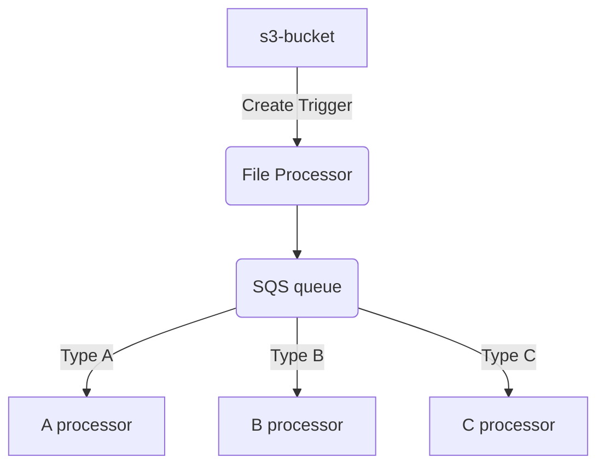

# Overview

When a file is written to an S3 bucket, a lambda is called which reads the file line by line and sends a message to a SQS 
queue for each line.




!!! This did not work put as planned !!!
Turns out an SQS queue can only have on consumer
The filter deletes any messages that does not pass the filter

See this for reference: https://lucvandonkersgoed.com/2022/01/20/the-9-ways-an-sqs-message-can-be-deleted/#:~:text=The%20messages%20not%20matching%20the,been%20designed%20for%20single%20consumers.


# Build
run 
```shell
./2-build.sh version push
```
This will build 'version' (eg 0.0.9) and push to ECR

TODO
* Use jib to build the image
  Jib puts the classews in /approot - need to 


# Local

Run the built image:

This relies on the auth details being in the .aws/credentials file, adjust if the environment is to be used
```shell
./4-start-local.sh
```

Once running, the lambda can be invoked with
```shell
curl "http://localhost:9000/2015-03-31/functions/function/invocations" --data-binary "@src/test/resources/s3-notification.json"
```


# Deploy
Edit `cfn-template.yaml` to make sure the image version matches the one built
run 
```shell
./3-deploy.sh
```

Note, the cloudformation creates the S3 bucket - arguably, this should be done externally and the name/arn passed in.


## removing stack
The stack does not remove cleanly if the bucket is not empty - need to empty first then delete the bucket.


# Testing
Copy a file to s3 - output should be made to cloud watch
aws s3 cp test-file.txt s3://file-input-sorted-net/test-file3.txt