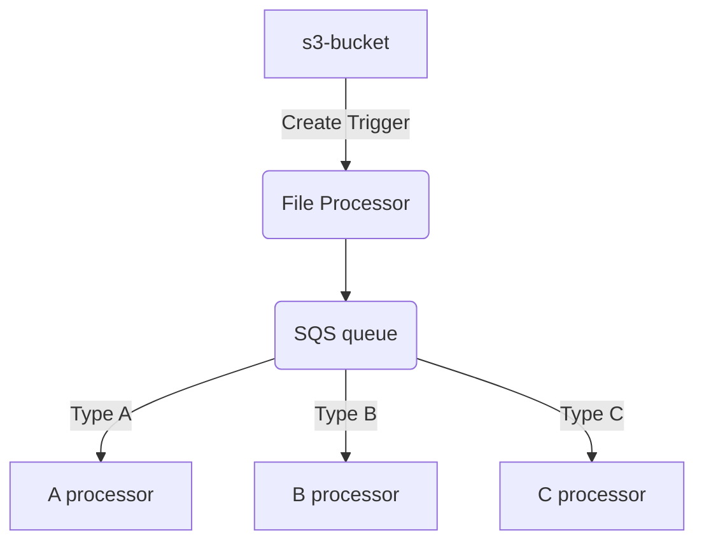

# Overview

When a file is written to an S3 bucket, a lambda is called which reads the file line by line and sends a message to a SQS 
queue for each line.





# Build
run 
```shell
./2-build.sh version push
```
This will build 'version' (eg 0.0.9) and push to ECR

# Deploy
Edit `cfn-template.yaml` to make sure the image version matches the one built
run 
```shell
./3-deploy.sh
```

## removing stack
The stack does not remove cleanly if the bucket is not empty - need to empty first then delete the bucket.


# Testing
Copy a file to s3 - output should be made to cloud watch
aws s3 cp test-file.txt s3://file-input-sorted-net/test-file3.txt